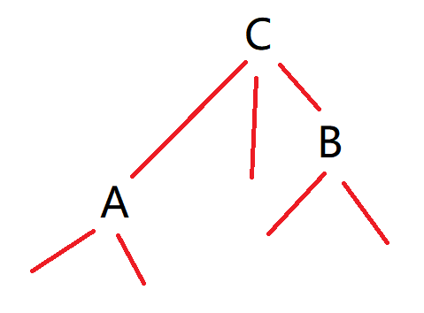
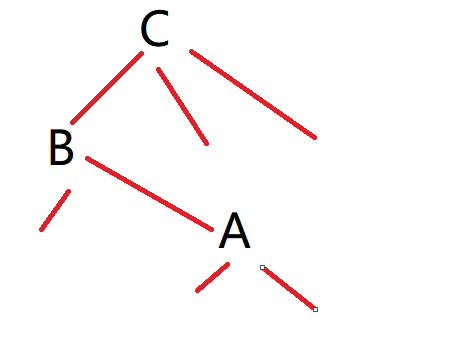
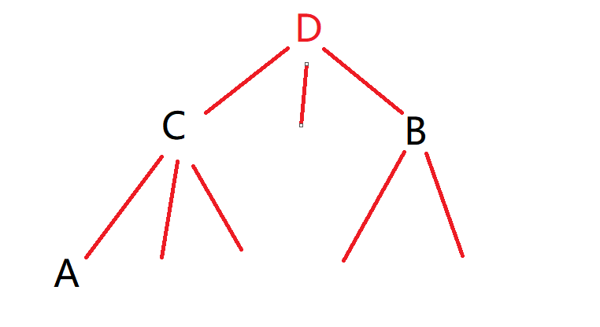
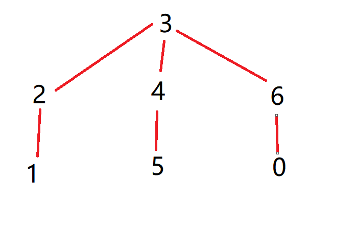

<!--
 * @Autor: violet apricity ( Zhuangpx )
 * @Date: 2021-12-16 19:18:47
 * @LastEditors: violet apricity ( Zhuangpx )
 * @LastEditTime: 2021-12-29 10:09:12
 * @FilePath: \work\DSExperiment\DSE\报告.md
 * @Description:  Zhuangpx : Violet && Apricity:/ The warmth of the sun in the winter /
-->

# 报告

## 题目

[问题描述]
    某个太空神秘国度中有很多美丽的小村，从太空中可以想见，小村间有路相连，更精确一点说，任意两村之间有且仅有一条路径。小村 A 中有位年轻人爱上了自己村里的美丽姑娘。每天早晨，姑娘都会去小村 B 里的面包房工作，傍晚 6 点回到家。年轻人终于决定要向姑娘表白，他打算在小村 C 等着姑娘路过的时候把爱慕说出来。问题是，他不能确定小村 C 是否在小村 B 到小村 A 之间的路径上。你可以帮他解决这个问题吗？
[基本要求]
（1）输入由若干组测试数据组成。每组数据的第 1 行包含一正整数 N ( l 《 N 《 50000 ) , 代表神秘国度中小村的个数，每个小村即从0到 N - l 编号。接下来有 N -1 行输入，每行包含一条双向道路的两个端点小村的编号，中间用空格分开。之后一行包含一正整数 M ( l 《 M 《 500000 ) ，代表着该组测试问题的个数。接下来 M 行，每行给出 A 、 B 、 C 三个小村的编号，中间用空格分开。当 N 为 O 时，表示全部测试结束，不要对该数据做任何处理。
（2）对每一组测试给定的 A 、 B 、C，在一行里输出答案，即：如果 C 在 A 和 B 之间的路径上，输出 Yes ，否则输出 No.

## 思路

将数据抽象，能够得到一棵有根树，并且存在若干棵子树。现考虑对问题解法进行分析。

首先暴力做法的时间复杂度是O(nm)的，通过分析发现能通过LCA(最近公共祖先)来解决(人为地认定子树存在上下级相对关系)，通过预处理得出A,B,C三点两两间的LCA之后即可在O(1)的时间下判断求解。分析如下：

设AB的LCA为Lab，AC的LCA为Lac，BC的LCA为Lbc。那么有：

1.当Lac=Lbc=C时，此时AB都位于以C为根的子树中，若Lab=C，即C为AB的最近公共祖先，显然AB的路径必经过C，否则，ABC同在一条链上，且C在链顶，显然C不在AB的路径上。

   

2.当Lac和Lbc中只有一个等于C时，A、B中有一个点位于以C根的子树中，而另一个点不在，则AB两点路径必然经过C(其中一点从子树蔓延至C，再向外蔓延到另一点)



3.其他情况C必然不在AB路径上

问题转化之后，我们将矛头指向LCA本身，考虑LCA的解法。

我们知道对于LCA问题有以下几种常见解法：

1.朴素暴力
2.倍增
3.树链剖分
4.Tarjan(离线)
5.化为RMQ①问题

现讨论几种解法的复杂度，以下记n为树的顶点个数，m为查询次数，A-1指反阿克曼函数(Ackermann 函数)。

朴素的暴力解法，可以每次找深度比较大的那个点，让它向上跳。显然在树上这两个点最后一定会相遇，相遇的位置就是想要求的 LCA。 或者先向上调整深度较大的点，令他们深度相同，然后再共同向上跳转，最后也一定会相遇。在跳的过程中假设向上跳的步数为d，发现此时问题具有单调性，可以通过二分来确定最终满足LCA的d。朴素算法预处理时需要dfs整棵树，时间复杂度O(n)，单次查询O(n)，由于随机树高O(logn)，所以在随机树上单次查询O(logn)。

倍增法，在上述的朴树算法中对跳转的d进行优化，即d倍增而非递增。通过倍增处理出一个d的结合集合，每次向上跳转时从集合里凑数来得到跳转的d。通过一次dfs预处理出每个点倍增跳转集合。倍增的预处理是O(nlogn)，单次查询是O(logn)，空间复杂度是O(nlogn)。

树链剖分，LCA 为两个游标跳转到同一条重链上时深度较小的那个游标所指向的点。预处理是O(n)，单次查询是O(logn)，空间复杂度是O(n)，各个方向都由于倍增(树链剖分的常数较小)跳转。

离线的Tarjan。对树dfs，回溯时将父节点合并到字节的的集合里(并查集)，假设对于节点u和v，v是后访问的节点。那么它们的LCA就是u所在集合里深度最小的点。显然dfs预处理就能得到每两个点的LCA。预处理需要O(n+mA-1(n))，或者可简化成O(n+m)：利用并查集(路径压缩+启发式合并)优化(这里的并查集比较特殊)单次调用find()函数能够做到A-1(n)且均摊O(1)而不是O(logn)③，单次查询复杂度O(1)，空间复杂度是O(m)，随着查询次数m的增长，时间和空间复杂度增长速度会增快。

转化成RMQ问题，可以实现预处理O(nlogn)，查询O(1)，空间复杂度O(nlogn)。

这里对后三种算法都进行实现，并选最后一种方法进行分析。

下面讨论如何将LCA问题转化为RMQ问题。

我们任意选定一个根节点对树进行dfs遍历，当第一次访问到某个节点或者回溯到某个节点时，都将其编号记录下来，会得到一个长度为2n-1的序列（这被称为树的欧拉序列）将节点u第一次出现在欧拉序列的位置记作pos(u)，将欧拉序列记作E[1...2n-1]。(欧拉序列可以看成是这棵树的一条欧拉回路经过的节点构成的序列)。于是我只要求从u到v的欧拉序列中深度最小的点即为他们的LCA。(对于两个节点u和v，dfs过程中u到v的路径一定会经过LCA(u,v)但不会经过LCA(u,v)的祖先)

于是通过欧拉序列将图上问题转化成了序列问题。将上面分析总结一下：

有了欧拉序列，我们可以通过一个数学式子在线性时间内将LCA问题转化为RMQ问题，考虑两个不同点u,v，那么有：

pos(lca(u,v))=min{pos(k)|k∈E[pos(u)..pos(v)]}

这个等式不难理解：从u走到v的过程中一定会经过LCA(u,v)，但不会经过LCA(u,v)的祖先。因此，从u走到v的过程中经过的欧拉序最小的结点就是LCA(u,v)。

用 DFS 计算欧拉序列的时间复杂度是O(n)，且欧拉序列的长度也是O(n)，所以 LCA 问题可以在O(n)的时间内转化成等规模的 RMQ 问题(求区间最小值)。

成功将LCA问题转化为RMQ问题之后，现只要考虑解决RMQ问题即可。

对于RMQ问题的解决方案，同样有多种，首先有朴素的暴力遍历，其次有树状数组和线段树这两种处理区间问题的高级数据结构，还有ST表同样可以解决。

考虑到本题只需要查询而不需要修改，即离线，不需要利用树状数组或者线段树进行在线修改，这里选择查询速度快且实现简单的ST表。

所谓ST表②，是一种基于倍增的高级数据结构，其预处理时间复杂度是O(nlogn)，查询是O(1)，而空间复杂度是O(nlogn)。对于解决本问题已经很优秀了。

到此问题就解决了。

关于实现，移步至代码板块。

注①：RMQ指区间最指查询。

注②：以下为ST表简介(此处不对原理赘述)
ST表基于倍增思想，支持静态区间处理(不支持动态维护)，离线预处理时间复杂度 θ（nlogn），在线查询时间θ（1），如果按照2^i倍增的话复杂度可以降至θ（logn），依旧没有线段树优。
然而，我们发现 max(x,x)=x，也就是说，区间最大值是一个具有“可重复贡献”性质的问题。即使用来求解的预处理区间有重叠部分，只要这些区间的并是所求的区间，最终计算出的答案就是正确的。
如果手动模拟一下，可以发现我们能使用至多两个预处理过的区间来覆盖询问区间，也就是说询问时的时间复杂度可以被降至 θ（1），在处理有大量询问的题目时十分有效。

注③：同时使用路径压缩和启发式合并之后，并查集的每个操作平均时间仅为A-1，其增长缓慢，因此单次操作的平均时间也就是今均摊复杂度可以认为是一个很小的常数。

注④：在解决此问题时存在实现方式优化，读入优化和编译器优化等将程序效率优化的方式(实际上当数据足够大输入输出的影响也很大)，考虑到问题本身是对算法的考察，因此不对其纳入。此外，关于各算法的介绍和复杂度的证明此处不多讨论，详见各大参考文献。

参考：

1.OiWiki最近公共祖先(<https://oi-wiki.org/graph/lca/#rmq>)

2.OiWiki并查集(<https://oi-wiki.org/ds/dsu/#_7>)

4.RANGE MINIMUM QUERY AND LOWEST COMMON ANCESTOR(<https://www.topcoder.com/thrive/articles/Range%20Minimum%20Query%20and%20Lowest%20Common%20Ancestor>)

5.《算法导论》

## 代码

```c++
/*
 * @Autor: violet apricity ( Zhuangpx )
 * @Date: 2021-12-16 20:19:55
 * @LastEditors: violet apricity ( Zhuangpx )
 * @LastEditTime: 2021-12-17 01:42:20
 * @FilePath: \work\DSExperiment\DSE\Zhuangpx.cpp
 * @Description:  Zhuangpx : Violet && Apricity:/ The warmth of the sun in the winter /
 */
///*
#include <stdio.h>
#include <iostream>
#include <time.h>
//利用宏定义规定数据范围
#define N 100005
#define M 1000005
#define LG 20
typedef struct edge //结构体edge表示存边节点
{
    int v;
    struct edge *next;
} edge;                                                                          //边的struct
edge *head[N], G[N << 1];                                                        //存边的数组
int cnt, lg[N];                                                                  //cnt为边的数量,lg为预处理的log值,由于浮点的log运算较慢,所以此处预处理出log函数值能节省时间
void addedge(int u, int v) { G[cnt] = (edge){v, head[u]}, head[u] = &G[cnt++]; } //加边
int dfn[N << 1], dep[N << 1], dfncnt, pos[N], st[LG][N << 1];
//dfn是存欧拉序列的数组,dep为欧拉序列元素对应的深度,pos为树上点在欧拉序列最先出现的地方,st则为st表预处理所需的空间
void dfs(int u, int d, int f) //dfs遍历
{
    dfn[++dfncnt] = u, pos[u] = dfncnt, dep[dfncnt] = d;
    for (edge *e = head[u]; e; e = e->next)
        if (e->v != f)
        {
            dfs(e->v, d + 1, u);
            dfn[++dfncnt] = u, dep[dfncnt] = d;
        }
}
void pre(int n) //  lg函数和ST表的预处理
{
    lg[0] = -1;
    for (int i = 1; i < (n << 1); i++) //  lg函数预处理
        lg[i] = lg[i >> 1] + 1;
    for (int i = 1; i < (n << 1); i++) //  ST表初始化
        st[0][i] = i;
    for (int i = 1; i <= lg[(n << 1) - 1]; i++) //  基于倍增(指数倍增)的ST表预处理
        for (int j = 1; j + (1 << i) - 1 < (n << 1); j++)
            st[i][j] = (dep[st[i - 1][j]] < dep[st[i - 1][j + (1 << (i - 1))]]) ? st[i - 1][j] : st[i - 1][j + (1 << (i - 1))];
}
inline int rmq(int u, int v) //查询
{
    int l = pos[u] < pos[v] ? pos[u] : pos[v], r = pos[u] > pos[v] ? pos[u] : pos[v];
    int s = lg[r - l + 1];
    return dep[st[s][l]] < dep[st[s][r - (1 << s) + 1]] ? st[s][l] : st[s][r - (1 << s) + 1];
}

int n, m, A, B, C;

inline void init()
{
    dfs(0, 0, 0);
    pre(n);
}

int main()
{
    // scanf("%d", &n);
    // while ( ~scanf("%d", &n) && n > 0)
    while (std::cin >> n && n > 0)              //  不断测试 当n=0时停止
    {
        for (int i = 1; i < n; i++)             //  读入
        {
            // scanf("%d%d", &A, &B);
            std::cin >> A >> B;
            addedge(A, B);
            addedge(B, A);
        }
        // 预处理
        init();
        // scanf("%d", &m);
        std::cin >> m;
        for (int i = 1; i <= m; i++)            //  查询
        {
            // scanf("%d%d%d", &A, &B, &C);
            std::cin >> A >> B >> C;
            int Lab = dfn[rmq(A, B)], Lac = dfn[rmq(A, C)], Lbc = dfn[rmq(B, C)];
            ///*
            if (Lac == C && Lbc == C)           //  情况一
                // printf("%s\n", (Lab == C) ? "Yes" : "No");
                std::cout << (Lab==C)? "Yes\n" : "No\n" ;
            else if (Lac == C || Lbc == C)      //  情况二
                // printf("Yes\n");
                std::cout << "Yes\n";
            else                                //  情况三
                // printf("No\n");
                std::cout << "No\n";
            //*/
        }
        // system("pause");
    }
    return 0;
}
//*/
```

## 结果

手动造出大小为七的树的样例，能够跑出正确结果：



```c++
// 2.in
7
1 2
2 3
3 4
4 5
3 6
6 0
7
2 3 1
4 5 2
1 6 3
2 6 4
1 3 5
1 1 6
6 5 0
// 2.out
No
No
Yes
No
No
No
No
```

现对效率进行验证。

首先利用Python脚本造出大小为100000的树，并进行100000次提问①，生成数据放在1.in文件，重定向IO流，从1.in读入数据，向1.out输出结果。 利用<time.h>文件里的clock_t获得当前时间，在程序开头和结尾分别获取，作差得到大致的运行时间(容易发现此法存在很大误差，不过对于解决本问题并没有影响)。如下：

```c++
// IO重定向
freopen("2.in", "r", stdin);
freopen("2.out", "w", stdout);
//  作差得到时间
clock_t time1 = clock();
/*
    主代码块
*/
//  时间以ms为单位，以Time:XXms的形式给出
std::cout << "Time:" << clock() - time1 << "ms" << std::endl;
```

注①：关于数据构造，此处利用Python工具包cyaron，具体参见<https://github.com/Zhuangpx/cyaron>
注②：此处不对输入输出，编译等进行优化，原因上述已谈过不再赘述。

对程序重复运行，得到时间大概在700ms左右，由于数据随机性可能导致常数不同，并且对于RMQ问题解决方案不同效率也不用同因此此时间只做参考，不过也可看出大概能在一秒内解决100000的数据，效率还算可观。

作为对比，将离线Tarjan和树链剖分两种实现方式也以同样数据运行测试，得到Tarjan的时间大概是360ms，而树链剖分的时间大概是660ms。

由于构造数据单一，可认为树链剖分和ST表的RMQ解法效率相当，而Tarjan在这种情况下效率可见的高。

附上测试代码：

RMQ

```c++
/*
 * @Autor: violet apricity ( Zhuangpx )
 * @Date: 2021-12-17 00:18:41
 * @LastEditors: violet apricity ( Zhuangpx )
 * @LastEditTime: 2021-12-17 13:49:26
 * @FilePath: \work\DSExperiment\DSE\RMQ.cpp
 * @Description:  Zhuangpx : Violet && Apricity:/ The warmth of the sun in the winter /
 */
#include <stdio.h>
#include <iostream>
#include <time.h>
//利用宏定义规定数据范围
#define N 100005
#define M 1000005
#define LG 20
typedef struct edge //结构体edge表示存边节点
{
    int v;
    struct edge *next;
} edge;                          //边的struct
edge *head[N], G[N << 1];        //存边的数组
int cnt, lg[N];                  //cnt为边的数量,lg为预处理的log值,由于浮点的log运算较慢,所以此处预处理出log函数值能节省时间
void addedge(int u, int v) { G[cnt] = (edge){v, head[u]}, head[u] = &G[cnt++]; } //加边
int dfn[N << 1], dep[N << 1], dfncnt, pos[N], st[LG][N << 1];
//dfn是存欧拉序列的数组,dep为欧拉序列元素对应的深度,pos为树上点在欧拉序列最先出现的地方,st则为st表预处理所需的空间
void dfs(int u, int d, int f) //dfs遍历
{
    dfn[++dfncnt] = u, pos[u] = dfncnt, dep[dfncnt] = d;
    for (edge *e = head[u]; e; e = e->next)
        if (e->v != f)
        {
            dfs(e->v, d + 1, u);
            dfn[++dfncnt] = u, dep[dfncnt] = d;
        }
}
void pre(int n) //  lg函数和ST表的预处理
{
    lg[0] = -1;
    for (int i = 1; i < (n << 1); i++)  //  lg函数预处理
        lg[i] = lg[i >> 1] + 1;
    for (int i = 1; i < (n << 1); i++)  //  ST表初始化
        st[0][i] = i;
    for (int i = 1; i <= lg[(n << 1) - 1]; i++)     //  基于倍增(指数倍增)的ST表预处理
        for (int j = 1; j + (1 << i) - 1 < (n << 1); j++)
            st[i][j] = (dep[st[i - 1][j]] < dep[st[i - 1][j + (1 << (i - 1))]]) ? st[i - 1][j] : st[i - 1][j + (1 << (i - 1))];
}
inline int rmq(int u, int v) //查询
{
    int l = pos[u] < pos[v] ? pos[u] : pos[v], r = pos[u] > pos[v] ? pos[u] : pos[v];
    int s = lg[r - l + 1];
    return dep[st[s][l]] < dep[st[s][r - (1 << s) + 1]] ? st[s][l] : st[s][r - (1 << s) + 1];
}

int n, m, A, B, C;

inline void init()
{
    dfs(0, 0, 0);
    pre(n);
}

int main()
{
    clock_t time1 = clock();
    freopen("1.in", "r", stdin);freopen("1.out", "w", stdout);
    // scanf("%d", &n);
    std::cin >> n;
    for (int i = 1; i < n; i++)         //  读入
    {
        // scanf("%d%d", &A, &B);
        std::cin >> A >> B;
        int d; std::cin >> d;
        addedge(A, B);
        addedge(B, A);
    }
    // 预处理
    init();
    // scanf("%d", &m);
    std::cin >> m;
    for (int i = 1; i <= m; i++)        //  查询
    {
        // scanf("%d%d%d", &A, &B, &C);
        std::cin >> A >> B >> C;
        int Lab = dfn[rmq(A, B)], Lac = dfn[rmq(A, C)], Lbc = dfn[rmq(B, C)];
        ///*
        if (Lac == C && Lbc == C)       //  情况一
            // printf("%s\n", (Lab == C) ? "Yes" : "No");
            std::cout << (Lab==C)? "Yes\n" : "No\n" ;
        else if (Lac == C || Lbc == C)  //  情况二
            // printf("Yes\n");
            std::cout << "Yes\n";
        else                            //  情况三
            // printf("No\n");
            std::cout << "No\n";
        //*/
    }
    std::cout << "Time:" << clock() - time1 << "ms" << std::endl;
    // system("pause");
    return 0;
}
```

树链剖分

```c++
/*
 * @Autor: violet apricity ( Zhuangpx )
 * @Date: 2021-12-17 00:18:45
 * @LastEditors: violet apricity ( Zhuangpx )
 * @LastEditTime: 2021-12-17 13:17:45
 * @FilePath: \work\DSExperiment\DSE\树链剖分.cpp
 * @Description:  Zhuangpx : Violet && Apricity:/ The warmth of the sun in the winter /
 */
#include <stdio.h>
#include <iostream>
#include <time.h>
#define N 100005

typedef struct edge
{
    int v;
    struct edge *next;
} edge;
edge *head[N], G[N << 1];
int siz[N], son[N], dep[N], top[N], fa[N], cnt;
void addedge(int u, int v) { G[cnt] = (edge){v, head[u]}, head[u] = &G[cnt++]; }
void dfs1(int u, int f)
{
    siz[u] = 1, son[u] = -1, fa[u] = f;
    for (edge *e = head[u]; e; e = e->next)
        if (e->v != f)
        {
            dep[e->v] = dep[u] + 1;
            dfs1(e->v, u);
            siz[u] += siz[e->v];
            if (son[u] == -1 || siz[son[u]] < siz[e->v])
                son[u] = e->v;
        }
}
void dfs2(int u, int t)
{
    top[u] = t;
    if (son[u] != -1)
        dfs2(son[u], t);
    for (edge *e = head[u]; e; e = e->next)
        if (e->v != fa[u] && e->v != son[u])
            dfs2(e->v, e->v);
}
int lca(int u, int v)
{
    while (1)
    {
        if (top[u] == top[v])
            return dep[u] > dep[v] ? v : u;
        if (dep[top[u]] > dep[top[v]])
            u = fa[top[u]];
        else
            v = fa[top[v]];
    }
}

int main()
{
    clock_t time1 = clock();
    freopen("1.in", "r", stdin);freopen("1.out", "w", stdout);
    int n, m, A, B, C;
    // scanf("%d", &n);
    std::cin >> n;
    for (int i = 1; i <= n - 1; i++)
    {
        // scanf("%d%d", &A, &B);
        std::cin >> A >> B;
        int d; std::cin >> d;
        addedge(A, B);
        addedge(B, A);
    }
    // scanf("%d", &m);
    std::cin >> m;
    dfs1(0, 0);
    dfs2(0, 0);
    for (int i = 1; i <= m; i++)
    {
        // scanf("%d%d%d", &A, &B, &C);
        std::cin >> A >> B >> C;
        int Lab = lca(A, B), Lac = lca(A, C), Lbc = lca(B, C);
        if (Lac == C && Lbc == C)
            // printf("%s\n", (Lab == C) ? "Yes" : "No");
            std::cout << (Lab==C)? "Yes\n" : "No\n";
        else if (Lac == C || Lbc == C)
            // printf("Yes\n");
            std::cout << "Yes\n";
        else
            // printf("No\n");
            std::cout << "No\n";
    }
    std::cout << "Time:" << clock() - time1 << "ms" << std::endl;
    return 0;
}
```

Tarjan

```c++
/*
 * @Autor: violet apricity ( Zhuangpx )
 * @Date: 2021-12-17 00:18:58
 * @LastEditors: violet apricity ( Zhuangpx )
 * @LastEditTime: 2021-12-17 13:31:15
 * @FilePath: \work\DSExperiment\DSE\Tarjan.cpp
 * @Description:  Zhuangpx : Violet && Apricity:/ The warmth of the sun in the winter /
 */
#include <stdio.h>
#include <stdbool.h>
#include <iostream>
#include <time.h>
#define N 100005
#define M 1000005

typedef struct edge
{
    int v;
    struct edge *next;
} edge;
typedef struct qnode
{
    int v, id;
    struct qnode *next;
} qnode;
edge *head[N], G[N << 1];
qnode *qhead[N], qG[M << 3];
bool vis[N];
int cnt, qcnt, lca[M << 3], p[N];
void addedge(int u, int v) { G[cnt] = (edge){v, head[u]}, head[u] = &G[cnt++]; }
void addq(int u, int v, int id)
{
    qG[qcnt] = (qnode){v, id, qhead[u]}, qhead[u] = &qG[qcnt++];
    qG[qcnt] = (qnode){u, id, qhead[v]}, qhead[v] = &qG[qcnt++];
}

int f(int x) { return (x == p[x]) ? x : (p[x] = f(p[x])); }
void dfs(int u)
{
    p[u] = u;
    vis[u] = 1;
    for (edge *e = head[u]; e; e = e->next)
        if (!vis[e->v])
        {
            dfs(e->v);
            p[e->v] = u;
        }
    for (qnode *q = qhead[u]; q; q = q->next)
        if (vis[q->v])
            lca[q->id] = f(q->v);
}
int A[M], B[M], C[M];
int main()
{
    clock_t time1 = clock();
    freopen("1.in", "r", stdin);freopen("1.out", "w", stdout);
    int n, m, u, v;
    // scanf("%d", &n);
    std::cin >> n;
    for (int i = 1; i < n; i++)
    {
        // scanf("%d%d", &u, &v);
        std::cin >> u >> v;
        int d;  std::cin >> d;
        addedge(u, v);
        addedge(v, u);
    }
    // scanf("%d", &m);
    std::cin >> m;
    for (int i = 0; i < m; i++)
    {
        // scanf("%d%d%d", &A[i], &B[i], &C[i]);
        std::cin >> A[i] >> B[i] >> C[i];
        addq(A[i], B[i], i * 3);
        addq(A[i], C[i], i * 3 + 1);
        addq(B[i], C[i], i * 3 + 2);
    }
    dfs(0);
    for (int i = 0; i < m; i++)
    {
        int LAB = lca[i * 3], LAC = lca[i * 3 + 1], LBC = lca[i * 3 + 2];
        if (LAB == A[i] && LAC == A[i] && LBC == C[i] || LAB == B[i] && LBC == B[i] && LAC == C[i])
            // puts("Yes");
            std::cout << "YES\n";
        else if (LAC == C[i] && LAB == LBC || LBC == C[i] && LAB == LAC)
            // puts("Yes");
            std::cout << "Yes\n";
        else
            // puts("No");
            std::cout << "No\n";
    }
    std::cout << "Time:" << clock() - time1 << "ms" << std::endl;
    return 0;
}
```
